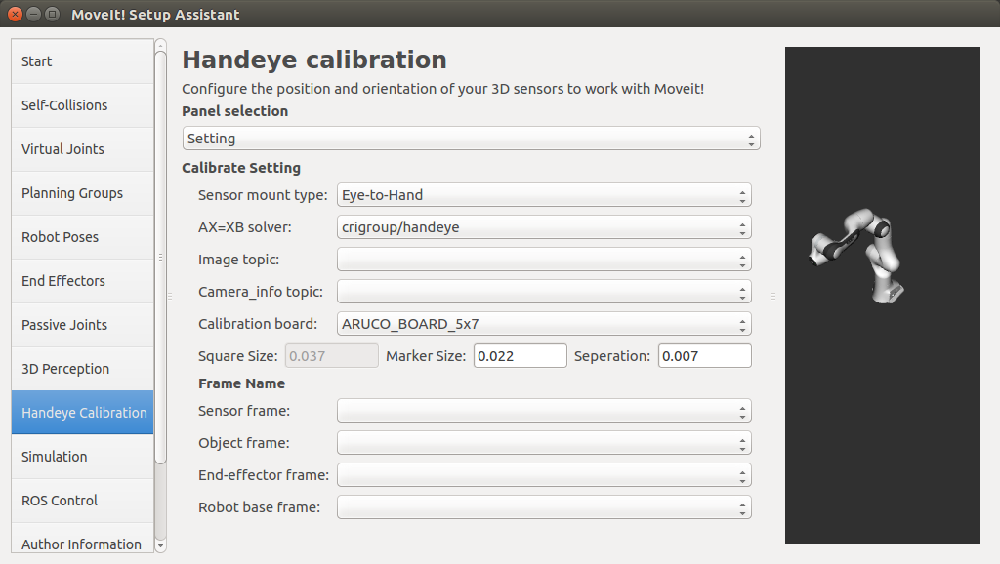
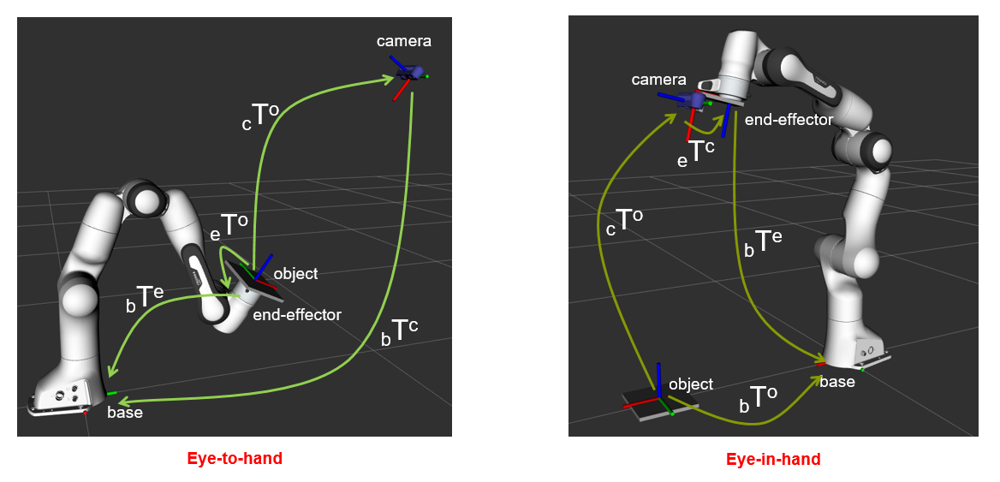
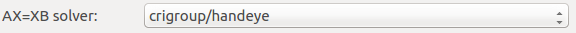
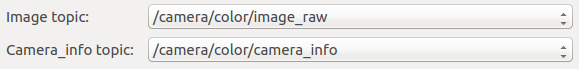
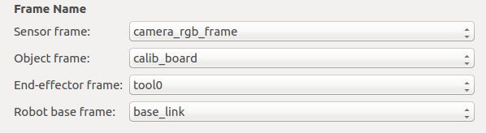
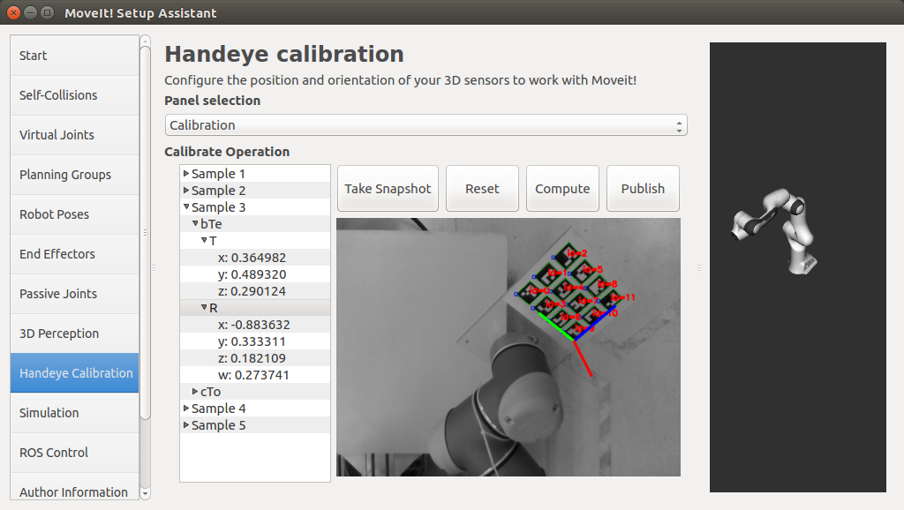

Handeye Calibration Tutorial
==============================

Overview
----------------------

Handeye Calibration screen of MoveIt! Setup Assistant is used to get the position and orientation of 3D sensors (e.g. cameras) 
with respect to a robot arm. It can be used to calibrate any robot arm with a USB camera, RGBD camera or Stereo camera. 
It can also be used to calibrate other kind of 3D sensor if an object localization method with this sensor is available, .

Getting Started
------------------------

Prerequisites:

* Make sure MoveIt! Setup Assistant can work properly and the UI interface similar to the figure above shows up.

* Make sure you have a camera which can publish RGB Image_ topic and CameraInfo_ topic.

  .. _Image: http://docs.ros.org/api/sensor_msgs/html/msg/Image.html
  .. _CameraInfo: http://docs.ros.org/api/sensor_msgs/html/msg/CameraInfo.html

* Gurantee that the robot arm ROS dirver can publish JointState_ topic,
  and the robot_state_publisher_ is brought up to publish `tf <http://wiki.ros.org/tf2>`_ info of links.

  .. _JointState: http://docs.ros.org/api/sensor_msgs/html/msg/JointState.html
  .. _robot_state_publisher: http://wiki.ros.org/robot_state_publisher?distro=melodic

* Download and install `handeye <https://github.com/crigroup/handeye>`_ package: ::

   sudo apt-get install ros-kinetic-handeye

* Run the handeye service: ::
  
   rosrun handeye handeye_server.py

* The panel selection combobox provides two options ``Setting`` and ``Calibration``:

  .. image:: images/panel_selection.png

  Choose ``Setting`` at first to config the parameters of hand-eye calibration. 
  ``Calibration`` panel includes the UI components to make the calibration operations.

Step 1: Set Sensor Mount Type
-------------------------------------

There are two types of camera-robot setup: ``Eye-to-Hand`` and ``Eye-in-Hand``:

* ``Eye-to-Hand``: the camera is fixed in front of or beside the robot, with the robot in the camera's FOV.
* ``Eye-in-Hand``: the camera is mounted on the robot arm, mostly on the end-effector link. 
* Choose the sensor mount type according to your camera-robot setup:

  .. image:: images/sensor_mount_type_2.png

Step 2: Select AX=XB Solver
-------------------------------------

Usually, hand-eye calibration is solved by ``AX=XB`` method. During the calibration process, 
the samples of two transforms are taken when the robot arm moves to a different pose:

* Transform from the detected object to the camera: (\ :sub:`c`\T\ :sup:`o`\)\ :sub:`i`\, *i* represents the *ith* sampling. 

* Transform from the robot end-effector to the robot base: (\ :sub:`b`\T\ :sup:`e`\)\ :sub:`i`\, *i* represents the *ith* sampling.

The first transform can be obtained by detecting the 6D pose of the object (i.e. calibration board) with respect to the camera. 
The second transform can be obtained by computing the foward kinematics from the robot base frame to the robot end-effector frame.

Currently, only the ``AX=XB`` solver ``TsaiLenz1989`` in the library ``crigroup/handeye`` is provided:

If you are not interested in the details of AX=XB, 
you can skip the rest content of this step.

* For ``Eye-in-Hand`` calibration, ``X`` is \ :sub:`e`\T\ :sup:`c`\, AX=XB is:
  
  (\ :sub:`e`\T\ :sup:`b`\)\ :sub:`i+1`\ * (\ :sub:`b`\T\ :sup:`e`\)\ :sub:`i`\ * \ :sub:`e`\T\ :sup:`c`\ = \ :sub:`e`\T\ :sup:`c`\ * (\ :sub:`c`\T\ :sup:`o`\)\ :sub:`i+1`\ * (\ :sub:`o`\T\ :sup:`c`\)\ :sub:`i`\

* For ``Eye-to-Hand`` calibration, ``X`` is \ :sub:`b`\T\ :sup:`c`\, AX=XB is:
  
  (\ :sub:`b`\T\ :sup:`e`\)\ :sub:`i+1`\ * (\ :sub:`e`\T\ :sup:`b`\)\ :sub:`i`\ * \ :sub:`b`\T\ :sup:`c`\ = \ :sub:`b`\T\ :sup:`c`\ * (\ :sub:`c`\T\ :sup:`o`\)\ :sub:`i+1`\ * (\ :sub:`o`\T\ :sup:`c`\)\ :sub:`i`\

For more background review of the hand-eye calibration, you can refer to this `link <http://campar.in.tum.de/Chair/HandEyeCalibration>`_ which includes 
a good collection of relevant academic researches in this field. 

Step 3: Select Image Topic and CameraInfo Topic 
--------------------------------------------------------

Choose the proper RGB Image_ topic, and CameraInfo_ topic:

If you are using a RGBD camera, such as `realsense <https://github.com/intel-ros/realsense>`_, most probably the two topics would be:
 
* The RGB Image_ topic is: /camera/color/image_raw

* The CameraInfo_ topic is: /camera/color/camera_info

.. note:: Once clicked, the two combobox is updated. If no topic names pop up, 
          please check if the RGB Image_ topic and CameraInfo_ topic is being published.
          After choosing an Image_ topic, you can switch to ``Calibration`` panel to check if the image is being displayed.

Step 4: Select Calibration Board
-------------------------------------

By default, the detection of four kinds of OpenCV calibration boards are supported: CHESSBOARD, ASYMMETRIC_CIRCLES_GRID, CHARUCO and ARUCO.

* Download and print the calibration board on an A4 paper without the border shrink. 
  You can use any one of the calibration boards below:

  * CHESS_BOARD_9X6

    .. image:: images/chessboard_9X6.png
       :width: 150px

  * ASYMMETRIC_CIRCLES_GRID_4X11

    .. image:: images/asymmetric_circles_grid_4X11.png
       :width: 150px  

  * ASYMMETRIC_CIRCLES_GRID_3X5

    .. image:: images/asymmetric_circles_grid_3X5.png
       :width: 150px 

  * ARUCO_BOARD_5X7

    .. image:: images/aruco_5X7_DICT_6X6_250.png
       :width: 150px

  * ARUCO_BOARD_3X4

    .. image:: images/aruco_3X4_DICT_4X4_50.png
       :width: 150px

  * CHARUCO_BOARD_5X7

    .. image:: images/charuco_5X7_DICT_6X6_250.png
       :width: 150px  

.. note:: For ``eye-in-hand`` calibration, the board needs to be installed on the robot end-effector. 
          For ``eye-to-hand`` calibration, the board can be put in the workspace of the robot. 
          The ``chessboard`` and ``asymmetric_circles_grid`` can only be detected when they are completely 
          in the FOV of the camera and not occluded. The ``charuco`` and ``aruco`` board can be detected 
          even if they are occluded partially. The experience shows that the ``aruco`` board works well in a close 
          distance to the camera. While the ``asymmetric_cirles_grid`` works better in a remote distance.

* Choose the board you are using from the ``Calibration board`` combobox:

  * If ``CHESS_BOARD_9X6`` is chosen, fill in the precise square size in meters:

    .. image:: images/chessboard_params.png

  * If ``ASYMMETRIC_CIRCLES_GRID_4X11`` is chosen, fill in the precise circles seperation distance in meters:

    .. image:: images/asymmetric_circles_grid_params.png

  * If ``ARUCO_BOARD_5X7`` is chosen, fill in the precise marker size and markers seperation distance in meters:

    .. image:: images/aruco_params.png

  * If ``CHARUCO_BOARD_5X7`` is chosen, fill in the precise black square size and marker size in meters:

    .. image:: images/charuco_params.png

.. note:: If you are not using the default board as the detecting object, 
          choose ``other`` and make sure the TF transform from the object frame to the 3D sensor frame is being published.

Step 5: Set Frame Names
---------------------------------------

As explained in `Step 2: Select AX=XB Solver`_, the hand-eye calibration will lookup for two kinds of transforms 
when the robot arm moves to different poses, i.e. the transform from the detected object to the camera, 
and the transform from the end-effector to the robot base. Therefore, you must specify the names of
the four frames on the screen:

* Sensor frame: the base frame of the 3D sensor, the default value is "camera_link". 

* Object frame: the frame of the detected object. If you choose a default calibration board in `Step 4: Select Calibration Board`_,
  the value would be "calib_board".

* End-effector frame: If you are making a ``Eye-to-Hand`` calibration, this is the robot link that 
  the calibration board attached to. If you are making a ``Eye-in-Hand`` calibration, this is the robot link that 
  the camera mounted on, e.g. "tool0" for the UR robot and "panda_link8" for the Franka Panda robot.

* Robot base frame: the base link of the robot arm, the default value is "base_link".

.. note:: If the right name cannot be found in the pop-up list, you can check the TF information through 
          `tf2 tools <http://wiki.ros.org/tf2/Tutorials/Introduction%20to%20tf2>`_.
   
Step 6: Start Calibration
------------------------------------------

Once the previous steps are done, you can switch to the ``Calibration`` panel to start the calibration process:

During the calibration process, the actions needed are:

* Move the calibration board to the FOV of the camera.
* Manually control the robot to rotate and translate the end-effector randomly in its X, Y, Z axes.  
* Check the image-view to make sure the pose of the calibration board is always recognizable. 
* Click the ``Take Snapshot`` button to take a sample when the robot moves to a stable pose.
* The rotation and translation components of the sampled transforms can be checked in the left tree-view by
  clicking and expanding the sub-items.

.. note:: The range of rotation and translation for the end-effector should be as much as possible. If nothing shows up in 
          the image-view or the pose estimation of a default calibration board is not correct, 
          please check if the Image and CameraInfo topics are set correctly in `Step 3: Select Image Topic and CameraInfo Topic`_. 
          Take as many samples as possible, at least 15 samples are recommanded. Be careful! ``Reset`` button is used to clear 
          all the samples.

Step 7: Compute Camera Robot Transform
----------------------------------------------

When enough samples are taken, click the ``Compute`` button to get the camera-robot transform.

Step 8: Check Calibration Result
--------------------------------------------

Click ``Publish`` button to publish a static TF transform between the camera and robot. 
The type of the static transform depends on the camera-robot setup chosen in `Step 2: Select AX=XB Solver`_.
You can check the result by bringing up ROS RViz and see if the frames of the camera and detected object are registered into 
the robot arm systems. The result will be stored in ``handeye_calibration.yaml`` under *MoveIt! Config Package/config*.